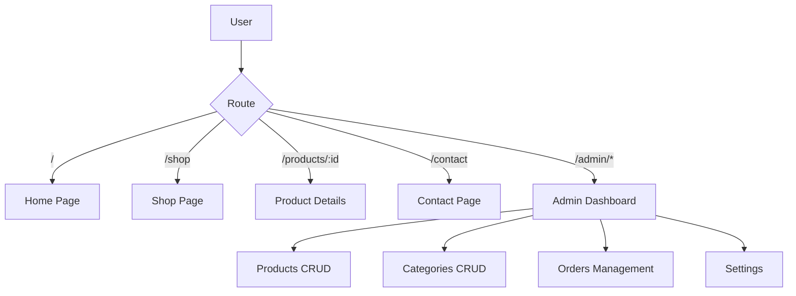

# Architecture Overview

## Technology Stack

| Layer | Technology |
|-------|------------|
| Framework | Next.js 14 (App Router) |
| Language | TypeScript |
| Styling | Tailwind CSS |
| State | React Context + localStorage |
| Icons | Inline SVG |

## Application Flow



## Data Flow

```
DataContext (React Context)
    ├── products[] ──────> ProductCard, Shop, Home
    ├── categories[] ────> CategoryCard, Filters
    ├── orders[] ────────> Admin Orders Table
    └── settings{} ──────> Contact Info, Footer

localStorage
    ├── lugx_products
    ├── lugx_categories
    ├── lugx_orders
    └── lugx_settings
```

## Component Hierarchy

```
RootLayout
├── DataProvider
│
├── PublicPages
│   ├── Header
│   ├── Page Content (Home/Shop/Product/Contact)
│   └── Footer
│
└── AdminLayout
    ├── Sidebar Navigation
    ├── Top Bar
    └── Page Content (Dashboard/Products/Categories/Orders/Settings)
```

## Key Design Decisions

1. **Frontend-only**: No backend required; uses localStorage for persistence
2. **App Router**: Leverages Next.js 14 file-based routing
3. **React Context**: Centralized state with CRUD operations
4. **Dark Admin Theme**: Premium look with navy/slate colors
